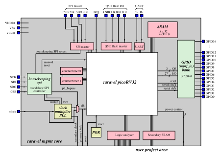
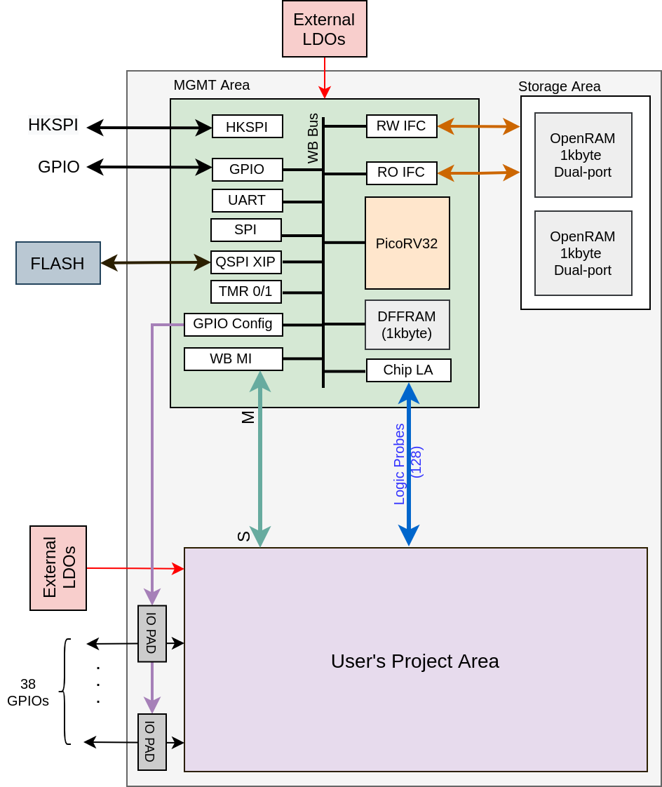

Working with the
# **Caravel Harness**
ZEN team: Cole Blackman, Justin Zhang, Ceylan Morgul
*ECE HPLP Lab UVA 2021*

---

# **Table of Contents**

### 1. Caravel 
### 2. Openlane (hardening process)
### 3. Caravel I/O
### 4. Future work (SHA256) 

---

# Background: Skywater PDK and Sky130 process node

- Open source toolset
- Google and Skywater
- Design fabrication processes and ICs
- WIP (not supported in production yet/alpha)
- https://skywater-pdk.readthedocs.io/en/latest/

---

# Background: OpenLane Flow

- Complete process for building GDSII database files (IC layouts)
- "Converts" designer's verilog files to GDSII instructions

---

---

# Background: Efabless Open MPW Shuttle Program

- Fabricates your Skywater PDK 130nm process design using Openlane for free
- Your design must conform to submission standards (open source, git-compatible repo, etc)
- Design must pass checks

---

# **Caravel**

- Test harness for Skywater 130nm OS PDK
- RISC-V RV32IMC IS running on PicoRV32 processor core
- **Provides a test "harness" consisting of tools like SRAM and GP I/O for open user area circuits** 

---

# Components of Caravel

**What does caravel provide the developer?**

- Wishbone (32-bit)
- 128-bit logic analyzer
- UART
- SPI controller and SPI flash controller
- Large SRAM
- I/O
- And more...

--- 

---

# Comments on Diagrams

- mprj_io I/O bank interfaces with caravel userspace
- User project area die size has decreased (from Efabless MPW Shuttle 1 to Shuttle 2)

---

---

# **Openlane Hardening**

---

# **Writing Verilog for Caravel**

We already saw overhead diagrams of the circuit layout, but how can a designer interface with I/O provided by the harness and build functional chips on this platform?

---

# Johnson Counter Example

- This example defines circuits for the caravel userspace, but does not require the use of I/O (see verilog code on our repository)

---

---

# IO Example: SHA2

*Unlike the previous example, this was written by Jean Cyr, not by us.

---

---

# **Our Work**

- Compiled documentation
- Wrote ECE Wiki pages
- Adapted SHA-3 for MPW Shuttle 2.0 and wrote SHA-3 documentation
- Wrote and hardened johnson counter within Openlane/Caravel harness (doesn't use I/O)  
- Wrote Verilog tutorial
- Adapted SHA-3 algorithm for a smaller die size

---

# **Our Future Work**

- Implementation of SHA-2 (256) hashing algorithm in a custom user area ASIC ontop of the Caravel Harness (Bitcoin/Crypto mining applications)
- Entrance into IEEE SSCS design contest

---

# **Key Takeaways**

- Skywater PDK - maturing and useful
- Caravel test harness - good for small applications and education

---

# **More Information /Sources /References**

- Caravel documentation: https://caravel-harness.readthedocs.io/en/latest/
- 
